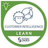
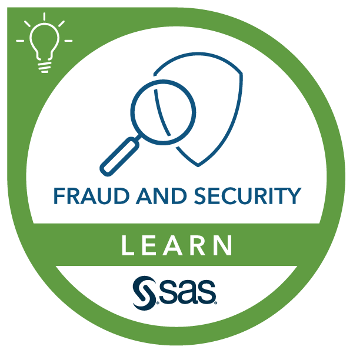
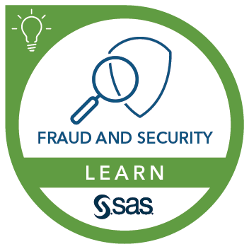
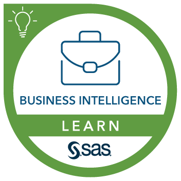
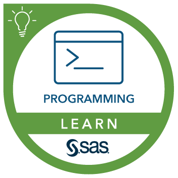
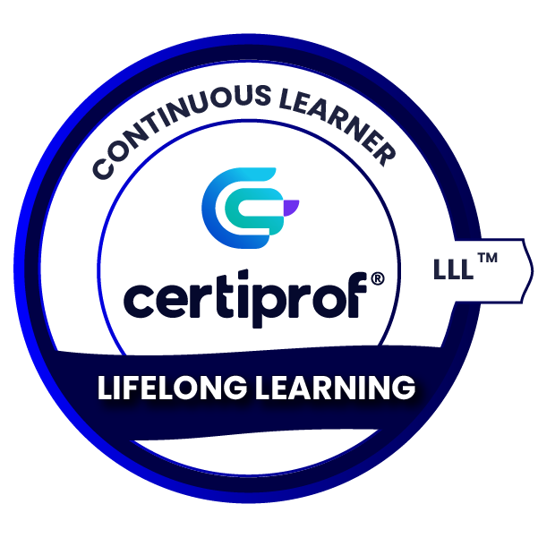

### Hi there 👋

Olá, sou Luíza Angelo Lovo, e atualmente trabalho como Consultora em Inteligência Analítica. No curso de Engenharia da Computação, aprendi temas como redes de computadores, comunicação de dados, bancos de dados, computação gráfica, sistemas digitais, circuitos elétricos, robótica e automação, e em paralelo me capacito continuamente através de curso como Business Intelligence - BI, Análise de Dados, Power BI, SQL, Python e SAS.

### 🎓 Formação
- Técnica em Informática - EEEFM "Ilda Ferreira da Fonseca Martins"
- Graduada em Engenharia de Computação - Multivix Vitória
- Pós-graduada em Ciência de Dados e Big Data - PUC Minas
- Pós-graduada em Engenharia de Dados - PUC Minas

### 💻 Ferramentas

  
  
  
  
  

          
### 👩🏼‍💻 Badges

  
  
  
  
  
  
  
  
  
  
  
  
  
  
  
  
  
  
  

### 📊 Estatisticas

### 📩 Contatos

  

<!--
**luizaalovo/luizaalovo** is a ✨ _special_ ✨ repository because its `README.md` (this file) appears on your GitHub profile.

Here are some ideas to get you started:

- 🔭 I’m currently working on ...
- 🌱 I’m currently learning ...
- 👯 I’m looking to collaborate on ...
- 🤔 I’m looking for help with ...
- 💬 Ask me about ...
- 📫 How to reach me: ...
- 😄 Pronouns: ...
- ⚡ Fun fact: ...
-->
